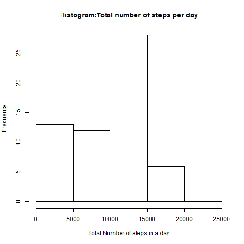
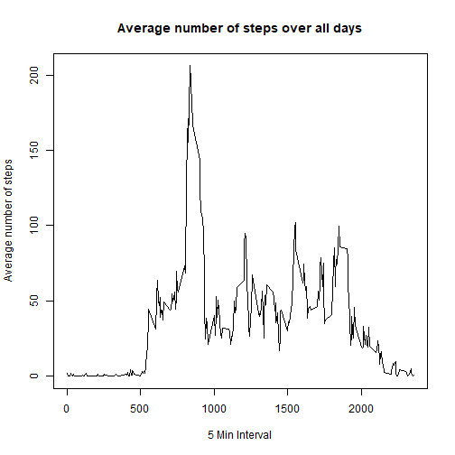
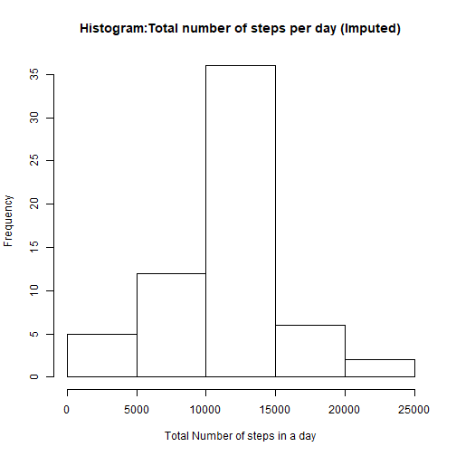
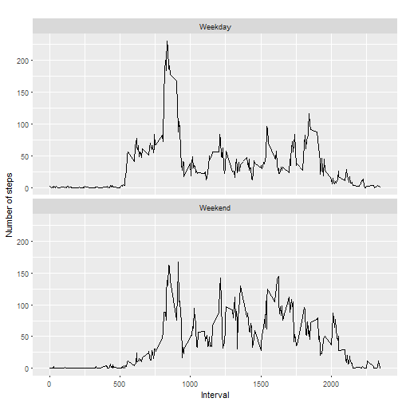

```r
---
title: "Reproducible Research Week 2 Course Project 1"
author: "Mohammad Umer Ayub"
date: "October 9, 2017"
output: github_document

---
```

```
## Error: <text>:9:0: unexpected end of input
## 7: ---
## 8: 
##   ^
```


##Loading and preprocessing the data
##1. Load the data

```r
x_data<-read.csv(file ="activity.csv")
```

```
## Warning in file(file, "rt"): cannot open file 'activity.csv': No such file
## or directory
```

```
## Error in file(file, "rt"): cannot open the connection
```

##2. Process/transform the data

```r
x_data$date= as.Date(x_data$date, "%Y-%m-%d")
summary(x_data)
```

```
##      steps             date               interval          day           
##  Min.   :  0.00   Min.   :2012-10-01   Min.   :   0.0   Length:17568      
##  1st Qu.:  0.00   1st Qu.:2012-10-16   1st Qu.: 588.8   Class :character  
##  Median :  0.00   Median :2012-10-31   Median :1177.5   Mode  :character  
##  Mean   : 37.38   Mean   :2012-10-31   Mean   :1177.5                     
##  3rd Qu.: 12.00   3rd Qu.:2012-11-15   3rd Qu.:1766.2                     
##  Max.   :806.00   Max.   :2012-11-30   Max.   :2355.0                     
##  NA's   :2304
```

##What is mean total number of steps taken per day
##1. Calculate the total number of steps taken per day

```r
X_data_agg_date<-aggregate(x_data$steps,by=list(x_data$date),FUN=sum, na.rm= TRUE )
X_data_agg_date
```

```
##       Group.1     x
## 1  2012-10-01     0
## 2  2012-10-02   126
## 3  2012-10-03 11352
## 4  2012-10-04 12116
## 5  2012-10-05 13294
## 6  2012-10-06 15420
## 7  2012-10-07 11015
## 8  2012-10-08     0
## 9  2012-10-09 12811
## 10 2012-10-10  9900
## 11 2012-10-11 10304
## 12 2012-10-12 17382
## 13 2012-10-13 12426
## 14 2012-10-14 15098
## 15 2012-10-15 10139
## 16 2012-10-16 15084
## 17 2012-10-17 13452
## 18 2012-10-18 10056
## 19 2012-10-19 11829
## 20 2012-10-20 10395
## 21 2012-10-21  8821
## 22 2012-10-22 13460
## 23 2012-10-23  8918
## 24 2012-10-24  8355
## 25 2012-10-25  2492
## 26 2012-10-26  6778
## 27 2012-10-27 10119
## 28 2012-10-28 11458
## 29 2012-10-29  5018
## 30 2012-10-30  9819
## 31 2012-10-31 15414
## 32 2012-11-01     0
## 33 2012-11-02 10600
## 34 2012-11-03 10571
## 35 2012-11-04     0
## 36 2012-11-05 10439
## 37 2012-11-06  8334
## 38 2012-11-07 12883
## 39 2012-11-08  3219
## 40 2012-11-09     0
## 41 2012-11-10     0
## 42 2012-11-11 12608
## 43 2012-11-12 10765
## 44 2012-11-13  7336
## 45 2012-11-14     0
## 46 2012-11-15    41
## 47 2012-11-16  5441
## 48 2012-11-17 14339
## 49 2012-11-18 15110
## 50 2012-11-19  8841
## 51 2012-11-20  4472
## 52 2012-11-21 12787
## 53 2012-11-22 20427
## 54 2012-11-23 21194
## 55 2012-11-24 14478
## 56 2012-11-25 11834
## 57 2012-11-26 11162
## 58 2012-11-27 13646
## 59 2012-11-28 10183
## 60 2012-11-29  7047
## 61 2012-11-30     0
```

##2. Make a histogram of the total number of steps taken each day

```r
hist(X_data_agg_date$x,main="Histogram:Total number of steps per day", 
     xlab="Total Number of steps in a day")
```



##3. Calculating mean and Median

```r
##mean
mean(X_data_agg_date$x)
```

```
## [1] 9354.23
```

```r
##Median
median(X_data_agg_date$x)
```

```
## [1] 10395
```


##What is the average daily activity pattern?
##1. Make a time series plot (i.e. type = "l") of the 5-minute interval (x-axis) and the average number of steps taken, averaged across all days (y-axis)

```r
##The average number of steps taken, averaged across all days
X_data_agg_intv<-aggregate(x_data$steps,by=list(x_data$interval),FUN=mean, na.rm= TRUE )
##Make a time series plot (i.e. type = "l") of the 5-minute interval (x-axis) and  (y-axis) 
plot(X_data_agg_intv$Group.1,X_data_agg_intv$x,type = 'l',
main="Average number of steps over all days", xlab="5 Min Interval", 
ylab="Average number of steps")
```



##2. On average across all the days in the dataset, contains the maximum number of steps

```r
X_data_agg_intv[which.max(X_data_agg_intv$x),]
```

```
##     Group.1        x
## 104     835 206.1698
```


##Imputing missing values
##1. Calculate and report the total number of missing values in the dataset (i.e. the total number of rows with NAs)

```r
sum(is.na(x_data$steps))
```

```
## [1] 2304
```

##2. Devise a strategy for filling in all of the missing values in the dataset.
##Strategy : Replacing the NA with MEAN of that specific Interval

##3. Create a new dataset that is equal to the original dataset but with the missing data filled in

```r
x_data_new<-x_data
for (i in 1:nrow(x_data_new)) {
        if (is.na(x_data_new$steps[i])) {
                
                intval_val <- x_data_new$interval[i]
                steps_val <- X_data_agg_intv[X_data_agg_intv$Group.1 == intval_val,]
                x_data_new$steps[i] <- steps_val$x
        }
}
```

##4. Make a histogram of the total number of steps taken each day and Calculate and report the mean and median total number of steps taken per day

```r
##Taking aggregate day by day
X_data_agg_date_new<-aggregate(x_data_new$steps,by=list(x_data_new$date),FUN=sum, na.rm= TRUE )
##Make a histogram of the total number of steps taken each day (Imputed)
hist(X_data_agg_date_new$x,main="Histogram:Total number of steps per day (Imputed)", 
     xlab="Total Number of steps in a day")
```



```r
##Calculating mean
mean(X_data_agg_date_new$x)
```

```
## [1] 10766.19
```

```r
##Calculating median
median(X_data_agg_date_new$x)
```

```
## [1] 10766.19
```

```r
##Yes the mean and median are have changed.
```

##Are there differences in activity patterns between weekdays and weekends?
##1.Create a new factor variable in the dataset with two levels - "weekday" and "weekend"

```r
x_data_new$day <- weekdays(x_data$date)
x_data_new$day[x_data_new$day%in% c('Saturday','Sunday') ] <- "Weekend"
x_data_new$day[x_data_new$day != "Weekend" ] <- "Weekday"
x_data_new$day_type <- as.factor(x_data_new$day)
```

##2. Make a panel plot containing a time series plot (i.e. type = "l") of the 5-minute interval (x-axis) and the average number of steps taken, averaged across all weekday days or weekend days (y-axis)

```r
X_data_agg_new_weekend_fact <- aggregate(steps ~ interval + day_type, x_data_new, mean)
library(ggplot2)
h<-qplot(interval,steps,data = X_data_agg_new_weekend_fact, type = 'l',  geom=c("line"),xlab = "Interval", 
      ylab = "Number of steps", main = "") + facet_wrap(~ day_type, ncol = 1)
```

```
## Warning: Ignoring unknown parameters: type
```

```r
print(h)
```


##Yes, Activity paterns are different Weekdays and Weekends
```

